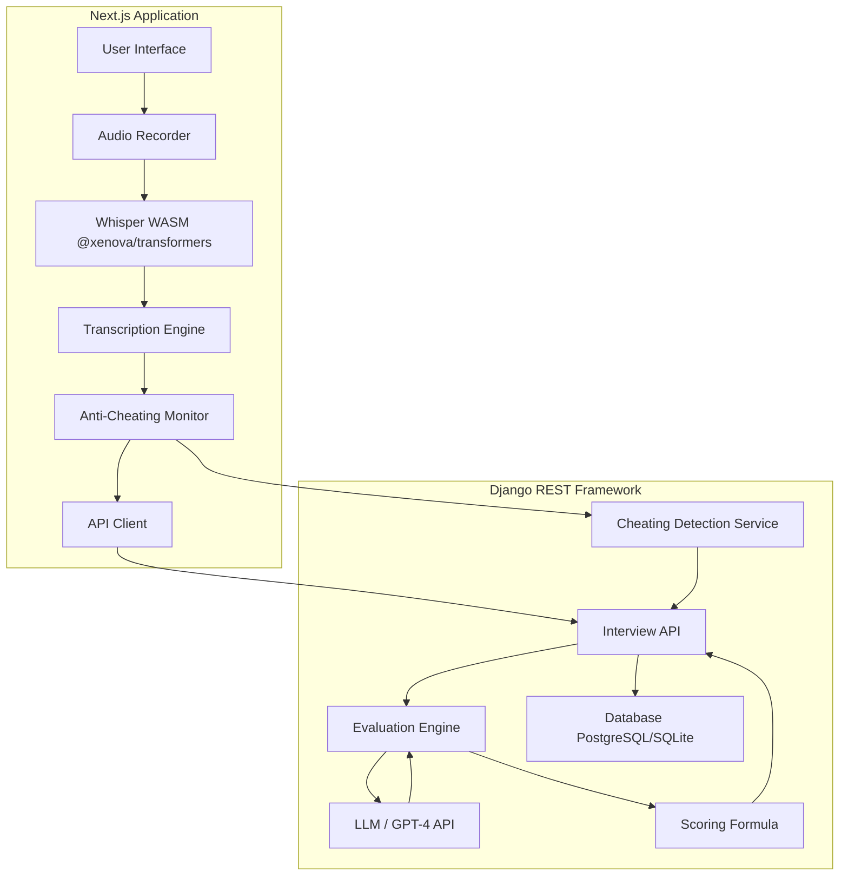

# AI Interview System Design

## System Architecture

## Component Breakdown

1.  **Frontend (Whisper WASM)**:
    *   **Implementation**: Uses `@xenova/transformers` to run the Whisper model locally in the browser via WebAssembly.
    *   **Workflow**: Audio is captured via `MediaRecorder` API, converted to the required sample rate (16kHz), and passed to the `pipeline('automatic-speech-recognition', 'openai/whisper-tiny.en')`.
    *   **Benefits**: Reduces server-side compute costs and latency while keeping audio data on the client side until transcription is complete.

2.  **Anti-Cheating Logic**:
    *   **Tab Focus Monitoring**: Uses the `Page Visibility API` and `window.onblur` / `window.onfocus` to track when a candidate leaves the interview tab.
    *   **Copy-Paste Detection**: Prevents or logs `paste` events in the answer text area.
    *   **Audio Artifact Analysis**: Detects long silences or unnatural speech patterns through the `MediaRecorder` and Whisper confidence scores.
    *   **Plagiarism Check**: The backend compares transcribed text against common online sources or previous high-scoring answers.

3.  **Evaluation Engine**:
    *   **LLM Integration**: Sends the transcribed text along with the question context to an LLM (e.g., GPT-4).
    *   **Prompting Strategy**: Uses a structured Few-Shot or Chain-of-Thought prompt to extract specific scores for Relevance, Technical Depth, Clarity, and Communication.

4.  **Scoring Formula (Production-Ready)**:
    *   **Base Score**: $S_{base} = 0.4 \cdot S_{tech} + 0.3 \cdot S_{rel} + 0.2 \cdot S_{clar} + 0.1 \cdot S_{comm}$
    *   **Penalty Multiplier**: $P = 1.0 - (0.2 \cdot \text{TabSwitches}) - (0.5 \cdot \text{CheatingFlagged})$
    *   **Final Score**: $S_{final} = \max(0, S_{base} \cdot P)$
    *   This formula ensures that cheating significantly impacts the final result while rewarding technical expertise and relevance.
